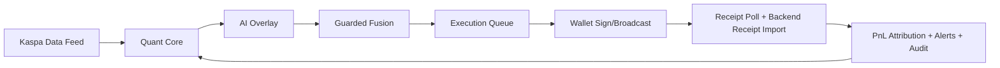
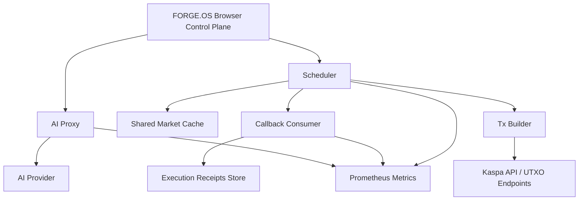

# FORGE.OS

```text
┌──────────────────────────────────────────────────────────────────────────────┐
│  46 4F 52 47 45 2E 4F 53  ::  KASPA-NATIVE QUANT / AI CONTROL PLANE         │
│                                                                              │
│   ███████╗ ██████╗ ██████╗  ██████╗ ███████╗      ██████╗ ███████╗           │
│   ██╔════╝██╔═══██╗██╔══██╗██╔════╝ ██╔════╝     ██╔═══██╗██╔════╝           │
│   █████╗  ██║   ██║██████╔╝██║  ███╗█████╗       ██║   ██║███████╗           │
│   ██╔══╝  ██║   ██║██╔══██╗██║   ██║██╔══╝       ██║   ██║╚════██║           │
│   ██║     ╚██████╔╝██║  ██║╚██████╔╝███████╗     ╚██████╔╝███████║           │
│   ╚═╝      ╚═════╝ ╚═╝  ╚═╝ ╚═════╝ ╚══════╝      ╚═════╝ ╚══════╝           │
│                                                                              │
│  [SIGNING: NON-CUSTODIAL] [NETWORK: MAINNET-FIRST] [TRUTH: RECEIPT-AWARE]   │
│  [MODE: QUANT CORE + REAL AI OVERLAY] [RUNTIME: OPERATOR-GRADE]             │
└──────────────────────────────────────────────────────────────────────────────┘
```

FORGE.OS is a **Kaspa-native quant trading control plane** with wallet-native signing, real AI overlay, deterministic quant guardrails, and production-oriented runtime controls.

<!-- If you're reading source, you're in the right place. FORGE.OS is built for operators, not just screenshots. -->

<p align="center">
  
  
  
  
  
</p>

It is built for operators who want:
- Kaspa-first execution (UTXO-aware, non-custodial signing)
- Real AI decisioning bounded by quant math and hard risk controls
- Multi-agent allocation with shared portfolio risk budgets
- Transparent queueing, receipts, attribution, and alerting
- A path from browser prototype to backend-scaled orchestration

<details>
<summary><strong>Quick Jump (Operator Index)</strong></summary>

- [Quick Start](#quick-start)
- [Mainnet / Testnet Runtime Switching](#mainnet--testnet-runtime-switching)
- [Wallet Support (Current)](#wallet-support-current)
- [Transaction Lifecycle + Receipts](#transaction-lifecycle--receipts)
- [Scaling Modules (Backend Starters)](#scaling-modules-backend-starters)
- [Operator Recipes (Copy/Paste)](#operator-recipes-copypaste)
- [Testing & Validation](#testing--validation)
- [GitHub DIY Ops Hacks](#github-diy-ops-hacks)
- [Troubleshooting By Symptom](#troubleshooting-by-symptom)
- [Production Readiness Checklist](#production-readiness-checklist)

</details>

## At A Glance (Operator Infographic)

| Plane | What It Does | Why It Matters |
| --- | --- | --- |
| **Decision** | Deterministic quant core -> real AI overlay -> guarded fusion | Keeps the AI useful, but bounded by math + risk rules |
| **Execution** | Wallet-native signing, queueing, lifecycle state machine, treasury routing | No seed storage, explicit approval paths, auditable tx flow |
| **Truth / Audit** | Receipts, provenance badges, consistency checks, audit signatures | Operators can tell what is estimated vs confirmed vs verified |
| **Scale** | AI proxy, scheduler, shared cache, callback consumer, metrics | Browser stays control plane while backend handles orchestration |

### Runtime Loop (Mermaid)



## Why FORGE.OS Is Different

Most “AI trading dashboards” stop at UI. FORGE.OS implements the actual runtime stack:
- **Wallet-native authorization** (Kasware, Kaspium, Demo) with no seed storage
- **Quant core first** (regime, volatility, Kelly/risk caps, EV sizing)
- **AI overlay second** (bounded by quant envelope; can run every cycle)
- **Execution lifecycle tracking** (submitted -> broadcasted -> pending confirm -> confirmed/failed/timeout)
- **Treasury fee routing** with on-chain payout support
- **Multi-agent portfolio allocator** with shared capital/risk constraints
- **Production-scale starters**: AI proxy + scheduler/shared market cache

## System Architecture (Text)

```text
WalletGate (Kasware / Kaspium / Demo)
  -> Wizard (agent config + strategy template)
  -> Dashboard (operator control plane)
     -> Kaspa Feed (price / blockdag / balance / utxos)
     -> Quant Engine Client (Web Worker preferred)
        -> Deterministic Quant Core (regime, vol, Kelly, EV, risk)
        -> Real AI Overlay (always/adaptive, bounded by quant core)
        -> Guarded Fusion (risk envelope + execution constraints)
     -> Execution Queue (signing lifecycle + receipt lifecycle)
     -> Treasury Payout (on-chain fee transfer, queue fallback)
     -> Alerts (Telegram / Discord / email-webhook)
     -> PnL Attribution (estimated + receipt-aware hybrid telemetry)

Scale Path (Server)
  -> AI Proxy (queueing, rate limits, retries, /health, /metrics)
  -> Scheduler + Shared Market Cache (multi-agent cycle dispatch, /metrics)
```

## Current Feature Set

### Core Runtime
- Wallet-gated access (`Kasware`, `Kaspium`, `Demo`)
- Mainnet-first boot with runtime network switching (`?network=mainnet|testnet`)
- Agent setup wizard with strategy templates:
  - DCA accumulator
  - Trend
  - Mean reversion
  - Volatility breakout
- Quant + AI decision engine with bounded fusion
- Web Worker quant/AI execution path (with controlled fallback)
- Accumulate-only execution discipline support

### Portfolio / Ops
- Multi-agent portfolio view with shared risk budget + capital allocator
- Action queue with manual sign / autonomous gating flows
- Receipt polling and lifecycle reconciliation for broadcast txs
- PnL attribution panel (signal quality / slippage / fees / timing / missed fills)
- Alerts panel (Telegram / Discord / email-webhook)
- Treasury panel + on-chain treasury payout flow
- Wallet panel (balance, UTXO view, withdraw tools)

### Reliability / Testing / Deployment
- Typecheck + lint + unit tests + perf tests + build + smoke validation
- Playwright E2E suite (wallet gate, queue sign/reject, treasury second tx, network switch, controls)
- GitHub Pages deploy + domain validation tooling
- AI proxy and scheduler backend starters with `/health` and Prometheus `/metrics`

## Quick Start

### Prerequisites
- Node.js 18+
- npm 9+
- Optional: Kasware extension
- Optional: Kaspium mobile wallet

### Install
```bash
npm install
```

### Run (Development)
```bash
npm run dev
```

### Strict Validation (Frontend + Build Integrity)
```bash
npm run ci
```

### E2E (Playwright)
```bash
npm run test:e2e
```

<details>
<summary><strong>Boot Sequence (Recommended Dev Flow)</strong></summary>

```bash
npm install
npm run ci
npm run dev
```

Then in a separate terminal:

```bash
npm run test:e2e
```

</details>

### Build / Preview
```bash
npm run build
npm run preview
```

## Operator Recipes (Copy/Paste)

<details>
<summary><strong>Local Confidence Pass (Fast)</strong></summary>

```bash
npm run ci
npm run test:e2e
```

Use this before changing runtime logic, wallet flows, or queue/receipt handling.

</details>

<details>
<summary><strong>Receipt Truth / Attribution Debug Pass</strong></summary>

```bash
npm run dev
# optional in separate shells (backend truth path)
node server/callback-consumer/index.mjs
node server/scheduler/index.mjs
```

Then in UI verify:
- queue truth labels (`BROADCASTED`, `CHAIN CONFIRMED`, `BACKEND CONFIRMED`)
- receipt provenance badges (`CHAIN`, `BACKEND`, `ESTIMATED`)
- PnL mode (`estimated`, `hybrid`, `realized`) and confirmation floor

</details>

<details>
<summary><strong>Redis Scheduler + Load Smoke (Multi-Instance)</strong></summary>

```bash
TEST_REDIS_URL=redis://127.0.0.1:6379 npm run test:scheduler:redis
LOAD_PIPELINE_SCHEDULER_REDIS_URL=redis://127.0.0.1:6379 \
LOAD_PIPELINE_CALLBACK_REDIS_URL=redis://127.0.0.1:6379 \
LOAD_PIPELINE_SCHEDULER_INSTANCES=2 \
npm run load:pipeline
```

This validates failover/idempotency safety paths, not just UI behavior.

</details>

## Environment (Overview)

Create `.env` from `.env.example`.

### Kaspa Network / RPC
- `VITE_KAS_API_MAINNET`
- `VITE_KAS_API_TESTNET`
- `VITE_KAS_API_FALLBACKS_MAINNET`
- `VITE_KAS_API_FALLBACKS_TESTNET`
- `VITE_KAS_EXPLORER_MAINNET`
- `VITE_KAS_EXPLORER_TESTNET`
- `VITE_KAS_WS_URL_MAINNET`
- `VITE_KAS_WS_URL_TESTNET`
- `VITE_KAS_NETWORK` (mainnet default in `.env.example`)
- `VITE_KAS_ENFORCE_WALLET_NETWORK`
- `VITE_KASPIUM_DEEP_LINK_SCHEME`

### Wallet / Execution / Treasury
- `VITE_ACCUMULATE_ONLY`
- `VITE_LIVE_EXECUTION_DEFAULT`
- `VITE_FEE_RATE`
- `VITE_TREASURY_SPLIT`
- `VITE_TREASURY_ADDRESS_MAINNET`
- `VITE_TREASURY_ADDRESS_TESTNET`
- `VITE_ACCUMULATION_ADDRESS_MAINNET`
- `VITE_ACCUMULATION_ADDRESS_TESTNET`
- `VITE_TREASURY_FEE_ONCHAIN_ENABLED`

### AI / Quant Runtime
- `VITE_AI_API_URL`
- `VITE_AI_MODEL`
- `VITE_ANTHROPIC_API_KEY` (frontend direct-call only; **backend proxy preferred**)
- `VITE_AI_FALLBACK_ENABLED`
- `VITE_AI_OVERLAY_MODE` (`always` default)
- `VITE_AI_OVERLAY_MIN_INTERVAL_MS`
- `VITE_AI_OVERLAY_CACHE_TTL_MS`
- `VITE_AI_SOFT_TIMEOUT_MS`
- `VITE_AI_MAX_ATTEMPTS`
- `VITE_QUANT_WORKER_ENABLED`
- `VITE_QUANT_WORKER_SOFT_TIMEOUT_MS`
- `VITE_DECISION_AUDIT_SIGNER_URL` (optional server-side cryptographic audit signer endpoint, `/v1/audit-sign`)
- `VITE_DECISION_AUDIT_SIGNER_TOKEN` (optional)
- `VITE_DECISION_AUDIT_SIGNER_TIMEOUT_MS`
- `VITE_DECISION_AUDIT_SIGNER_REQUIRED`
- `VITE_DECISION_AUDIT_SIGNER_PUBLIC_KEY_URL`, `VITE_DECISION_AUDIT_SIGNER_PINNED_FINGERPRINTS`, `VITE_DECISION_AUDIT_SIGNER_REQUIRE_PINNED` (UI-side signature verification + key pinning)

### Backend Receipt Import (Optional, Recommended For Realized PnL)
- `VITE_EXECUTION_RECEIPT_IMPORT_ENABLED`
- `VITE_EXECUTION_RECEIPT_API_URL`
- `VITE_EXECUTION_RECEIPT_API_TOKEN`
- `VITE_EXECUTION_RECEIPT_API_TIMEOUT_MS`
- `VITE_PNL_REALIZED_MIN_CONFIRMATIONS`
- `VITE_PNL_REALIZED_CONFIRMATION_POLICY_JSON` (tiered realized confirmation policy by action/risk/amount)

### Quota / Monetization / Runtime Cadence
- `VITE_FREE_CYCLES_PER_DAY`
- `VITE_BILLING_UPGRADE_URL`
- `VITE_BILLING_CONTACT`
- `VITE_AUTO_CYCLE_SECONDS`

## Mainnet / Testnet Runtime Switching

FORGE.OS is **mainnet-first**.

Runtime network selection precedence:
1. `?network=` query param
2. runtime override (`localStorage`, guarded)
3. `VITE_KAS_NETWORK`
4. fallback `mainnet`

Examples:
- `https://forge-os.xyz/?network=mainnet`
- `https://forge-os.xyz/?network=testnet`

Address validation, explorer links, treasury routing, and accumulation vault routing all follow the active profile.

## Wallet Support (Current)

### Capability Snapshot (Infographic Matrix)

| Wallet | Connect | Send | Multi-Output | Network Checks | Signing Custody |
| --- | --- | --- | --- | --- | --- |
| **Kasware** | Extension | `sendKaspa` | No (single-recipient path) | Yes | Wallet-side |
| **Kaspium** | Deep-link/manual | Deep-link + `txid` handoff | No | Yes | Wallet-side |
| **Kastle** | Extension | `sendKaspa` / `signAndBroadcastTx` | Conditional (raw tx path) | Yes | Wallet-side |
| **Ghost Wallet** | Provider bridge | `transact` | Yes (outputs array) | Yes | Wallet-side |
| **Tangem** | Bridge/manual | External sign+broadcast | Bridge-dependent | Address/profile validation in app | Device-side |
| **OneKey** | Bridge/manual | External sign+broadcast | Bridge-dependent | Address/profile validation in app | Device-side |
| **Demo** | Local | Simulated | Simulated | N/A | N/A |

### Kasware (Browser Extension)
- Extension connect (`requestAccounts`, `getNetwork`)
- Network/profile enforcement (configurable)
- Send path (`sendKaspa`)
- Stronger timeout/error normalization in adapter
- Native multi-output send: **no** (single-recipient send path)
- Future path: PSKT/raw tx signing route may enable combined treasury output

### Kaspium (Mobile Deep-Link Flow)
- Mainnet-first connect behavior (testnet still optional)
- Deep-link transfer generation
- Manual `txid` handoff for receipt tracking
- Address-prefix validation (`kaspa:` / `kaspatest:`)
- Native multi-output send: **no** (current deep-link flow is single-recipient + manual `txid`)

### Kastle (Browser Extension)
- Injected `window.kastle` provider support in WalletGate and runtime adapter
- Connect/account/network checks with mainnet/testnet profile enforcement
- Send path (`sendKaspa`) wired into Forge.OS queue/signing lifecycle
- Wallet selector uses the real Kastle logo in UI
- Native multi-output send: **conditional** via `signAndBroadcastTx(networkId, txJson)` when the `VITE_KASTLE_RAW_TX_ENABLED` raw-tx path is enabled and a txJson bridge/manual txJson input is available

### Ghost Wallet (Browser Extension / Provider Bridge)
- Custom `kaspa:*` provider event bridge support in WalletGate and runtime adapter
- Connect/account/network checks with profile enforcement
- `transact` send path wired into Forge.OS queue/signing lifecycle
- Wallet selector uses the real Ghost Wallet logo in UI
- Native multi-output send: **yes** (`transact` accepts an outputs array; Forge.OS combines treasury fee output when eligible)

### Tangem (Hardware / Bridge Flow)
- Manual bridge connect (address pairing) in WalletGate
- External sign/broadcast flow with txid handoff back into Forge.OS
- Preserves hardware custody model (no private key handling in Forge.OS)
- Native multi-output send: **bridge/manual dependent**

### OneKey (Hardware / Bridge Flow)
- Manual bridge connect (address pairing) in WalletGate
- External sign/broadcast flow with txid handoff back into Forge.OS
- Preserves hardware custody model (no private key handling in Forge.OS)
- Native multi-output send: **bridge/manual dependent**

### Demo Mode
- Local tx/txid simulation for UI and testing workflows

## Treasury Routing

Mainnet treasury is pinned in code and validated at startup.

**Pinned mainnet treasury address:**
- `kaspa:qpv7fcvdlz6th4hqjtm9qkkms2dw0raem963x3hm8glu3kjgj7922vy69hv85`

Notes:
- Treasury micro-fee payout is sent as a **separate tx** for wallets without native multi-output support.
- Ghost Wallet can combine action + treasury outputs into a single transaction when the tx shape is eligible.
- Kastle can also use a combined treasury multi-output path when the feature-flagged raw-tx route is enabled and a raw txJson source is available.
- If treasury payout fails or is rejected, it is queued as a `TREASURY_FEE` action.
- Spendable balance calculations reserve treasury payout + network fee to avoid overspend.

## Transaction Lifecycle + Receipts

Queue items now track both:

### Signing Lifecycle
- `pending`
- `signing`
- `signed`
- `rejected`
- `failed`

### Receipt Lifecycle
- `submitted`
- `broadcasted`
- `pending_confirm`
- `confirmed`
- `failed`
- `timeout`

FORGE.OS polls Kaspa transaction endpoints with backoff and persists receipt telemetry, including:
- `submitted_ts`
- `broadcast_ts`
- `confirm_ts`
- `confirm_ts_source` (`chain` when receipt block timestamp is available)
- `confirmations`
- `failure_reason`
- `receipt_fee_kas` / `receipt_fee_sompi` (when exposed by API payload)
- price snapshot telemetry at broadcast/confirm when available

This feeds receipt-aware attribution (`estimated` / `hybrid` / `realized`) and improves operator trust in execution state.

Forge.OS also enforces a **truth degradation policy**:
- if backend-vs-chain receipt mismatch rate exceeds policy thresholds, `realized` attribution is downgraded to `hybrid`
- optional policy can block autonomous auto-approve until receipt consistency recovers

### Truth Ladder (What Counts As Real)

```mermaid
flowchart LR
  A[SIMULATED] --> B[BROADCASTED]
  B --> C[BACKEND CONFIRMED]
  B --> D[CHAIN CONFIRMED]
  C --> E[Receipt Consistency Check]
  D --> E
  E --> F[Realized PnL (confirmation floor policy)]
```

### Operator Trust Signals (UI)

| Signal | Meaning |
| --- | --- |
| **Truth Label** | Execution state (`SIMULATED`, `BROADCASTED`, `BACKEND CONFIRMED`, `CHAIN CONFIRMED`, `ESTIMATED`) |
| **Receipt Provenance** | Where confirmation telemetry came from (`CHAIN`, `BACKEND`, `ESTIMATED`) |
| **Consistency Badge** | Whether backend and chain telemetry agree within configured tolerances |
| **Audit Verification Badge** | Browser-side crypto signature verification + signer key pin status |

## Real AI + Quant Intelligence

FORGE.OS uses a **quant-first, AI-bounded** model:
- Deterministic quant core computes regime, volatility, risk score, EV, Kelly cap, SL/TP, and sizing
- Real AI overlay refines decisions using quant context
- Guarded fusion enforces risk limits and can block unsafe AI actions
- Calibration guardrails can automatically:
  - reduce `ACCUMULATE` sizing when calibration quality degrades
  - disable auto-approve when calibration health falls below policy

Production guidance:
- Prefer backend proxy (`VITE_AI_API_URL`) for AI calls
- Keep API keys server-side
- Use `VITE_AI_OVERLAY_MODE=always` for max AI involvement
- Use `VITE_AI_FALLBACK_ENABLED=false` if you require strict AI availability (no silent quant fallback)

## Scaling Modules (Backend Starters)

### AI Proxy (`server/ai-proxy`)
Run:
```bash
npm run ai:proxy
```

Provides:
- queueing
- per-user rate limiting
- transient retry/backoff
- concurrency caps
- `GET /health`
- `GET /metrics` (Prometheus)

Prometheus metrics include:
- queue depth / in-flight / saturation state
- HTTP response counters
- upstream success / error / retry counters
- proxy latency histogram
- upstream latency histogram

### Scheduler + Shared Market Cache (`server/scheduler`)
Run:
```bash
npm run scheduler:start
```

Provides:
- multi-agent registry (in-memory by default, Redis-backed persistence optional)
- server-side cycle scheduler queue with concurrency caps (Redis-authoritative execution queue when enabled)
- shared market snapshot cache (price/blockdag/balance) with TTL + in-flight dedupe
- optional token/service-token/JWT/JWKS auth with scopes + per-user quotas
- optional Redis-backed agent persistence + due schedule (degraded startup if Redis unavailable)
- optional Redis-authoritative due schedule + Redis execution queue + leader lock fencing + per-agent/task leases for multi-instance safety
- callback idempotency keys + fence-token propagation to downstream consumers (`X-ForgeOS-*` headers and payload metadata)
- `GET /health`
- `GET /metrics` (Prometheus)
- `POST /v1/agents/register`
- `GET /v1/market-snapshot?address=...`
- `POST /v1/scheduler/tick`

This is the bridge toward moving orchestration out of the browser.

### Backend Scale Topology (Mermaid)



### Tx Builder (`server/tx-builder`)
Run:
```bash
npm run tx-builder:start
```

Provides:
- backend tx-builder endpoint for automatic `Kastle` `signAndBroadcastTx(..., txJson)` flows
- local `kaspa-wasm` builder mode (`TX_BUILDER_LOCAL_WASM_ENABLED=true`) for true automatic Kastle multi-output txJson generation from UTXOs
- command-hook mode (`TX_BUILDER_COMMAND`) for local Kaspa tx-builder integration
- bundled command executable `server/tx-builder/commands/kastle-http-bridge-command.mjs` for real `TX_BUILDER_COMMAND` deployments that proxy a dedicated builder
- upstream proxy mode (`TX_BUILDER_UPSTREAM_URL`)
- `GET /health`
- `GET /metrics`

Frontend integration:
- `VITE_KASTLE_TX_BUILDER_URL`
- `VITE_KASTLE_TX_BUILDER_TOKEN` (optional)
- `VITE_EXECUTION_RECEIPT_API_URL` / `VITE_EXECUTION_RECEIPT_API_TOKEN` (optional backend receipt import for UI PnL / receipt reconciliation)

### Callback Consumer (Reference) (`server/callback-consumer`)
Run:
```bash
npm run callback-consumer:start
```

Provides:
- downstream scheduler callback receiver with idempotency enforcement
- leader fence-token enforcement (`X-ForgeOS-Leader-Fence-Token`)
- exact execution receipt ingestion endpoints for backend attribution pipelines
- Redis Lua-backed atomic fence/idempotency checks when Redis is enabled
- receipt consistency telemetry counters in `/metrics` (checks, mismatches, mismatch type breakdown) for frontend-reported backend-vs-chain consistency checks
- `GET /health`
- `GET /metrics`
- `GET /v1/events`
- `POST /v1/scheduler/cycle`
- `GET/POST /v1/execution-receipts`

### Audit Signer (Reference) (`server/audit-signer`)
Run:
```bash
npm run audit-signer:start
```

Provides:
- server-side cryptographic signatures for frontend decision audit records
- local-key mode (Ed25519 PEM) and HSM/KMS-ready command mode (`AUDIT_SIGNER_COMMAND`)
- optional append-only hash-chained JSONL audit export (`AUDIT_SIGNER_APPEND_LOG_PATH`) for external verification / replay
- UI can verify signer signatures client-side and enforce pinned signer fingerprints when configured
- `GET /health`
- `GET /metrics`
- `GET /v1/public-key` (local-key mode)
- `GET /v1/audit-log`
- `POST /v1/audit-sign`

Offline verification:
```bash
npm run audit-log:verify -- --file ./forgeos-audit.jsonl --strict-signatures
```

### Operator Grafana Dashboard (Starter)
- Import `ops/grafana/forgeos-operator-overview.json` into Grafana.
- Add Prometheus recording/alert rules:
  - `ops/prometheus/forgeos-recording-rules.yml`
  - `ops/prometheus/forgeos-alert-rules.yml`
- Includes backend truth/control/execution panels for:
  - receipt consistency checks/mismatches + mismatch types (callback-consumer)
  - scheduler queue/saturation and callback duplicate/stale-fence signals
  - tx-builder local policy efficiency (selected inputs / fee / fallback usage)

<details>
<summary><strong>Hidden Ops Notes (GitHub-friendly collapsible)</strong></summary>

- The browser app is the **operator control plane**; it is not intended to be an HFT execution engine.
- For real scale, pair `server/ai-proxy` and `server/scheduler` with Redis/Postgres plus distributed scheduler locking.
- Ghost Wallet supports a treasury-combined multi-output path. Kastle has a feature-flagged raw-tx combined path (`signAndBroadcastTx`) when a txJson source is provided. Other wallets use the separate treasury payout tx fallback.
- Exact realized attribution still improves significantly once fill/confirmation receipts are ingested from a backend execution service.

</details>

## Testing & Validation

### Local Validation Commands
```bash
npm run lint
npm run typecheck
npm run test:run
npm run test:perf
npm run load:pipeline
npm run build
npm run ci
npm run test:e2e
```

### Command Map (What To Run / When)

| Goal | Command | Notes |
| --- | --- | --- |
| Fast local correctness | `npm run ci` | Includes domain verify, lint, typecheck, tests, build, fallback sync/verify, smoke |
| UI flow validation | `npm run test:e2e` | Playwright flows for wallet gate / queue / treasury / controls |
| Redis scheduler semantics | `npm run test:scheduler:redis` | Runs Redis-backed scheduler integration specs when `TEST_REDIS_URL` is set |
| Pipeline performance smoke | `npm run load:pipeline` | Supports threshold assertions and multi-scheduler mode |
| Tx-builder policy benchmark | `npm run bench:tx-policy` | Bench coin-selection + fee policy behavior across synthetic UTXO shapes |
| Audit export verification | `npm run audit-log:verify -- --file ./forgeos-audit.jsonl --strict-signatures` | Offline hash-chain + signature verification |

### E2E Coverage (Playwright)
Current flows include:
- demo wallet gate
- mocked Kasware wallet gate
- queue reject/sign flow
- treasury second-tx queue/sign flow
- network switching reset + URL update
- pause / resume / kill-switch controls

<details>
<summary><strong>CI Notes (Why E2E Is Separate)</strong></summary>

- `npm run ci` focuses on fast correctness gates (lint/typecheck/unit/build/smoke/domain).
- Playwright E2E runs in a dedicated GitHub Actions job for clearer failures and artifact uploads.
- The Playwright config uses strict port binding and CI-specific server reuse behavior for stability.

</details>

## GitHub DIY Ops Hacks

<details>
<summary><strong>GitHub UI Power Moves (Maintainers / Reviewers)</strong></summary>

| Goal | GitHub Trick | Why It Helps |
| --- | --- | --- |
| Stable code references | Press <kbd>y</kbd> on a file page | Converts to a permalink tied to a commit |
| Link exact code lines | Append `#Lx` (for example `#L120`) | Makes review comments and docs precise |
| Quick repo editor | Press <kbd>.</kbd> on repo page | Opens GitHub web editor instantly |
| Fast search | Use code search qualifiers (`path:src`, `lang:ts`) | Speeds hotspot audits and refactors |
| Compare releases | `/compare/<sha1>...<sha2>` | Clean change review before deploy |
| Blame regressions | “Blame” + line permalink | Tracks when a behavior changed |

</details>

<details>
<summary><strong>Deployment Cleanup / Artifact Triage (GitHub Actions)</strong></summary>

- Keep `CI`, `Deploy Pages`, and (if enabled) load jobs visible in Actions favorites.
- Use workflow run artifacts for:
  - Playwright failure screenshots/videos
  - load harness metrics output
  - build/fallback verification traces
- When triaging a deploy issue:
  1. open `CI`
  2. confirm `build` and `smoke`
  3. open `Deploy Pages`
  4. run `npm run domain:check`
  5. verify live `manifest.json` points to the latest `assets/index-*.js`

</details>

## Troubleshooting By Symptom

| Symptom | First Check | Command / Action |
| --- | --- | --- |
| Wallet connects but send flow fails | Wallet network/address prefix mismatch | Verify `kaspa:` vs `kaspatest:` and topbar network selector |
| Queue stays `BROADCASTED` too long | Receipt path health | Check callback-consumer `/health` and `/metrics`, then chain receipt polling |
| PnL stays `hybrid` not `realized` | Confirmation floor / receipt consistency | Check PnL header confirmation floor + queue provenance badges |
| Auto-approve stops firing | Calibration or truth guardrail degradation | Review `Intelligence` + runtime notices banners |
| Scheduler duplicate callback concerns | Fence/idempotency counters | Check callback-consumer metrics + Redis scheduler tests |
| Pages deploy looks old | Artifact / manifest drift | `npm run domain:check` and inspect live `manifest.json` |

## Deployment / Domain

### GitHub Pages
- Workflow: `.github/workflows/deploy-pages.yml`
- Pages source should be **GitHub Actions** (not branch mode)
- Custom domain: `forge-os.xyz`

### Domain Tooling
```bash
npm run verify:domain
npm run domain:check
npm run domain:watch
```

## Production Readiness Checklist

1. Configure network-scoped mainnet/testnet Kaspa endpoints (`*_MAINNET`, `*_TESTNET`).
2. Set `VITE_KAS_ENFORCE_WALLET_NETWORK=true` for stricter wallet/profile matching.
3. Verify treasury and accumulation addresses per network.
4. Use backend AI proxy; do not expose production AI secrets in browser.
5. Run `npm run ci` and `npm run test:e2e`.
6. Ensure GitHub Actions `CI` and `Deploy Pages` are green.
7. Validate real wallet flows on production:
   - Kasware connect/sign/send
   - Kaspium deep-link + `txid` confirmation
   - treasury fee payout destination and queue fallback behavior

<details>
<summary><strong>Operator Launch Sequence (1-minute sanity path)</strong></summary>

1. `npm run ci`
2. `npm run test:e2e`
3. Start backend modules you need (`ai-proxy`, `scheduler`, `callback-consumer`, `tx-builder`)
4. Confirm `/health` + `/metrics` on each enabled backend service
5. Connect a real wallet on mainnet (`forge-os.xyz`)
6. Execute one small transaction and verify:
   - queue truth label updates
   - receipt provenance badge
   - treasury route destination
   - attribution reflects confirmation state

</details>

## Repo Map (High Signal)

- `src/ForgeOS.tsx` — root shell + topbar + network switch + multi-agent session state
- `src/components/WalletGate.tsx` — wallet connect gate (Kasware/Kaspium/demo)
- `src/components/wizard/*` — agent setup + strategy templates + deploy flow
- `src/components/dashboard/*` — runtime UI panels
- `src/components/dashboard/hooks/*` — dashboard runtime hooks (feed, lifecycle, queue, treasury, alerts, allocator)
- `src/quant/*` — quant math, quant core, AI fusion engine, worker client
- `src/wallet/WalletAdapter.ts` — wallet transport mechanics and safety checks
- `src/tx/queueTx.ts` — tx validation/build/broadcast helpers
- `src/runtime/*` — lifecycle, errors, persistence, alerts, quotas, portfolio state
- `src/api/kaspaApi.ts` — Kaspa REST integration + receipt lookups
- `server/ai-proxy/*` — AI proxy starter + metrics
- `server/scheduler/*` — scheduler/shared cache starter + metrics
- `server/callback-consumer/*` — reference downstream callback receiver + receipt ingestion starter
- `tests/*` — unit, perf, and E2E suites

## Security Guardrails

- No seed phrase or private key storage in app/backend logic
- Wallet-side signing only (Kasware / Kaspium)
- Kaspa prefix validation enforced (`kaspa:` / `kaspatest:`)
- Quant guardrails constrain AI decisions before execution
- Explicit lifecycle states and error taxonomy for queue/receipt handling

<details>
<summary><strong>Threat Model Snapshot</strong></summary>

- **Do not** move seed/private key handling into frontend or backend services.
- Treat all AI outputs as untrusted until validated by quant/risk envelopes.
- Keep network profile, address prefix, and treasury routing checks explicit and testable.
- Prefer backend AI proxy for secrets, observability, and rate limiting.

</details>

## Core Docs

- `README.dev.md` — developer architecture and implementation notes
- `docs/kaspa/links.md` — curated Kaspa resource index
- `docs/ai/kaspa-elite-engineer-mode.md` — AI engineering brief
- `docs/ops/custom-domain.md` — custom domain ops runbook
- `AGENTS.md` — repo operating rules for agents/contributors

## License / Notes

This repo is designed as a **Kaspa-first operator platform** and a production-minded foundation for wallet-native quant automation.

If you are extending wallets/integrations, keep the repo standards intact:
- UTXO-first thinking
- non-custodial signing boundaries
- no insecure key handling
- network-aware address validation
